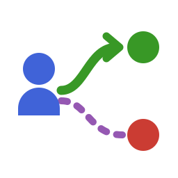

# Siena.jl


[](https://github.com/statistical-network-analysis-with-Julia/Siena.jl)
[](https://github.com/statistical-network-analysis-with-Julia/Siena.jl/actions/workflows/CI.yml?query=branch%3Amain)
[](https://statistical-network-analysis-with-Julia.github.io/Siena.jl/stable/)
[](https://statistical-network-analysis-with-Julia.github.io/Siena.jl/dev/)
[](https://julialang.org/)
[](https://opensource.org/licenses/MIT)

<p align="center">
  
</p>

A Julia implementation of SIENA (Simulation Investigation for Empirical Network Analysis) for analyzing longitudinal network data using Stochastic Actor-Oriented Models (SAOM).

This is a port of [RSiena](https://github.com/stocnet/rsiena), the R implementation developed by Tom Snijders and colleagues.

## Overview

Stochastic Actor-Oriented Models are statistical models for analyzing:
- **Longitudinal network data**: Repeated observations of network ties over time
- **Network-behavior co-evolution**: How networks and actor behaviors influence each other
- **Multivariate networks**: Multiple network relations analyzed jointly
- **Two-mode networks**: Bipartite/affiliation networks

The models assume that the network evolves through a continuous-time Markov chain of actor-driven "micro-steps" - small changes made by individual actors based on their local network position and attributes.

## Installation

```julia
using Pkg
Pkg.add(url="https://github.com/statistical-network-analysis-with-Julia/Siena.jl")
```

## Quick Start

```julia
using Siena

# Create data container
data = siena_data()
add_nodeset!(data, NodeSet(50))

# Add dependent network (3 observation waves)
# Each element is an adjacency matrix (no self-loops)
networks = [[Int(rand() < 0.08 && i != j) for i in 1:50, j in 1:50] for _ in 1:3]
add_dependent!(data, DependentNetwork(:friendship, networks))

# Add actor covariate
add_covariate!(data, ConstantCovariate(:gender, rand(0:1, 50)))

# Get effects and specify model
effects = get_effects(data)
include_effects!(effects, :friendship, [:outdegree, :recip, :transTrip])

# Configure algorithm
alg = siena_algorithm(seed=42, verbose=true)

# Estimate model
result = siena07(data, effects; algorithm=alg)

# Assess goodness of fit
gof_indeg = siena_gof_indegree(result, data, :friendship; n_sims=100)
```

## Key Functions

### Data Preparation

| Function | Description | RSiena Equivalent |
|----------|-------------|-------------------|
| `siena_data()` | Create data container | `sienaDataCreate()` |
| `NodeSet(n)` | Define node set | `sienaNodeSet()` |
| `DependentNetwork(name, nets)` | Network dependent variable | `sienaDependent(..., type="oneMode")` |
| `DependentBehavior(name, vals)` | Behavior dependent variable | `sienaDependent(..., type="behavior")` |
| `ConstantCovariate(name, vals)` | Time-constant covariate | `coCovar()` |
| `VaryingCovariate(name, vals)` | Time-varying covariate | `varCovar()` |
| `ConstantDyadCovariate(name, mat)` | Dyadic covariate | `coDyadCovar()` |

### Model Specification

| Function | Description | RSiena Equivalent |
|----------|-------------|-------------------|
| `get_effects(data)` | Create effects object | `getEffects()` |
| `include_effects!(effects, var, names)` | Include effects | `includeEffects()` |
| `effects_table(effects)` | View effects as DataFrame | `print(effects)` |

### Estimation

| Function | Description | RSiena Equivalent |
|----------|-------------|-------------------|
| `siena07(data, effects)` | Estimate model | `siena07()` |
| `siena_algorithm(...)` | Configure algorithm | `sienaAlgorithmCreate()` |

### Goodness of Fit

| Function | Description | RSiena Equivalent |
|----------|-------------|-------------------|
| `siena_gof(result, data, stat)` | GOF assessment | `sienaGOF()` |
| `siena_gof_indegree(...)` | Indegree GOF | `sienaGOF(..., IndegreeDistribution)` |
| `siena_gof_outdegree(...)` | Outdegree GOF | `sienaGOF(..., OutdegreeDistribution)` |
| `siena_gof_triad(...)` | Triad census GOF | `sienaGOF(..., TriadCensus)` |

## Available Effects

### Structural Network Effects

- `outdegree` - Density/outdegree effect
- `recip` - Reciprocity
- `transTrip` - Transitive triplets
- `transTies` - Transitive ties
- `cycle3` - Three-cycles
- `inPop`, `inPopSqrt` - Indegree popularity
- `outAct`, `outActSqrt` - Outdegree activity
- `gwesp` - Geometrically weighted edgewise shared partners

### Covariate Effects on Networks

- `egoX` - Ego effect (sender covariate)
- `altX` - Alter effect (receiver covariate)
- `simX` - Similarity effect
- `sameX` - Same value effect (homophily)
- `diffX` - Difference effect
- `dyadX` - Dyadic covariate effect

### Behavior Effects

- `linear` - Linear shape
- `quad` - Quadratic shape
- `avAlt` - Average alter effect
- `avSim` - Average similarity effect
- `totAlt` - Total alter effect
- `effFrom` - Effect from covariate
- `indeg` - Indegree effect on behavior
- `outdeg` - Outdegree effect on behavior

## Model Theory

SAOMs model network change as a sequence of probabilistic micro-steps:

1. **Rate function**: Determines how often each actor gets an opportunity to make a change
2. **Objective function**: Determines which changes actors prefer (ties to create/dissolve, behavior changes)

The objective function for actor *i* considering tie change to actor *j*:

$$f_i(x, z) = \sum_k \beta_k s_{ik}(x, z)$$

where $s_{ik}$ are network statistics and $\beta_k$ are parameters to estimate.

Estimation uses the Method of Moments with stochastic approximation (Robbins-Monro algorithm).

## Validation against RSiena

The statistical core is validated against RSiena 4.x on RSiena's bundled `s50`
dataset:

- **Target statistics** (Method-of-Moments moment conditions) match RSiena's
  `getTargets` to 6 decimals for 34 checked effects — rates, structural network
  effects (`transTrip`, `cycle3`, `between`, `denseTriads`, degree effects with and
  without `sqrt`, …), covariate effects (`egoX`/`altX`/`simX`/`sameX`/`egoXaltX`),
  and behavior co-evolution effects (`linear`, `quad`, `avAlt`, `avSim`, `totSim`,
  `indeg`, `outdeg`, `effFrom`).
- **Estimates**: unconditional MoM estimation of the standard
  `density + recip + transTrip` model on `s50` agrees with RSiena within Monte-Carlo
  error (|z| ≤ 0.1 for every parameter, including the rate parameters and standard
  errors of comparable magnitude).

Every closed-form change statistic is verified in the test suite against a
brute-force toggle of the actor evaluation function.

## Differences from RSiena

- **Unconditional Method of Moments only**: conditional estimation (conditioning on
  observed amounts of change), Maximum Likelihood, and Bayesian estimation are not
  implemented.
- **Endowment/creation effects** are supported in simulation but not yet in
  estimation; `include_interaction!` is not yet implemented.
- **Derivative matrix** is estimated by finite differences with common random
  numbers rather than RSiena's score-function method.
- Missing data, composition change, and structural zeros/ones are not yet handled
  in estimation.
- A few rarely used effects use simplified definitions; these are flagged in their
  docstrings (e.g. `balance`, `avAttHigher`/`avAttLower`).

## Documentation

For more detailed documentation, see:

- [Stable Documentation](https://statistical-network-analysis-with-Julia.github.io/Siena.jl/stable/)
- [Development Documentation](https://statistical-network-analysis-with-Julia.github.io/Siena.jl/dev/)

## References

1. Snijders, T.A.B. (2017). Stochastic Actor-Oriented Models for Network Dynamics. *Annual Review of Statistics and Its Application*, 4, 343-363.

2. Ripley, R.M., Snijders, T.A.B., Boda, Z., Vörös, A., and Preciado, P. (2023). *Manual for RSiena*. University of Oxford.

3. Snijders, T.A.B. (2001). The Statistical Evaluation of Social Network Dynamics. *Sociological Methodology*, 31(1), 361-395.

4. [RSiena on CRAN](https://cran.r-project.org/package=RSiena)

## License

MIT License - see [LICENSE](LICENSE) for details.
