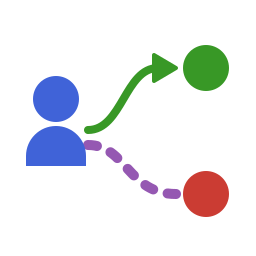

# Siena.jl


[](https://github.com/statistical-network-analysis-with-Julia/Siena.jl)
[](https://github.com/statistical-network-analysis-with-Julia/Siena.jl/actions/workflows/CI.yml?query=branch%3Amain)
[](https://statistical-network-analysis-with-Julia.github.io/Siena.jl/dev/)
[](https://julialang.org/)
[](https://opensource.org/licenses/MIT)

<p align="center">
  
</p>

A Julia implementation of SIENA (Simulation Investigation for Empirical Network Analysis) for analyzing longitudinal network data using Stochastic Actor-Oriented Models (SAOM).

This is a port of [RSiena](https://github.com/stocnet/rsiena), the R implementation developed by Tom Snijders and colleagues.

## Overview

Stochastic Actor-Oriented Models are statistical models for analyzing:
- **Longitudinal network data**: Repeated observations of network ties over time
- **Network-behavior co-evolution**: How networks and actor behaviors influence each other
- **Multivariate networks**: Multiple network relations analyzed jointly
- **Two-mode networks**: Bipartite/affiliation networks

The models assume that the network evolves through a continuous-time Markov chain of actor-driven "micro-steps" - small changes made by individual actors based on their local network position and attributes.

## Installation

Requires Julia 1.12+. Siena.jl depends on the unregistered
[NetworkCore.jl](https://github.com/statistical-network-analysis-with-Julia/NetworkCore.jl) package, which must be added first:

```julia
using Pkg
Pkg.add(url="https://github.com/statistical-network-analysis-with-Julia/NetworkCore.jl")
Pkg.add(url="https://github.com/statistical-network-analysis-with-Julia/Siena.jl")
```

The examples below also use `Random` (a standard library). For development,
clone the ecosystem repositories side by side (each package's `[sources]` entries
point at its `../<Pkg>.jl` siblings) and build a shared environment with the
website repository's `tools/prepare_workspace.jl`.

## Quick Start

```julia
using Siena, NetworkCore, Random

s50 = load_dataset(:s50)
data = siena_data()
add_nodeset!(data, NodeSet(50))
add_dependent!(data, DependentNetwork(:friendship, s50.friendship))
add_covariate!(data, ConstantCovariate(:smoke1, s50.smoke[:, 1]))
effects = get_effects(data)            # RSiena's defaults: rates, outdegree, recip
include_effects!(effects, :friendship, [:transTrip, :altsmoke1, :egosmoke1, :simsmoke1])
result = fit_siena(data, effects; rng=MersenneTwister(1),
                   algorithm=SienaAlgorithm(verbose=false))
result.converged                       # true: all |t| < 0.1 and tconv.max < 0.25
result.rate_estimates[:friendship]     # conditional rate estimates, one per period
report = gof(result; n_sim=100, rng=Xoshiro(2))
```

As RSiena's `getEffects()`, `get_effects` already includes the default effects:
the basic rates, `outdegree` (RSiena's `density`) and `recip` for a directed network,
and `linear` and `quad` for a behaviour. Naming them again changes nothing, and
`include_effects!(effects, :friendship, [:recip]; include=false)` removes one. With
one dependent variable the fit is **conditional** on the observed amount of change,
as RSiena's default (`cond = NA`); `SienaAlgorithm(conditional=false)` gives the
unconditional estimator. Effects can also be selected with RSiena's own spelling:
`include_effects!(effects, :friendship, [:egoX, :altX, :simX]; interaction1=:smoke1)`.

## Interoperability with NetworkCore.jl

Siena.jl depends on
[NetworkCore.jl](https://github.com/statistical-network-analysis-with-Julia/NetworkCore.jl).
Its panel conversion methods load as ordinary source. It converts panels of `Network` objects straight into Siena's data
types, so you can describe cross-sections with SNA.jl and model their dynamics
with Siena.jl without manual matrix wrangling:

```julia
using NetworkCore, Siena
waves = load_dataset(:s50).friendship
panel = DependentNetwork(:friendship, waves)
println(n_waves(panel))
```

The conversion preserves directedness (undirected networks yield symmetric
matrices and `directed=false`, which Siena.jl models with RSiena's model type 2 for
non-directed networks), maps two-mode networks (`network(n; bipartite=n₁)` or
`BipartiteNetwork`) to `:twomode` dependent variables whose ties run from the
mode-1 actors to the mode-2 nodes (a directed two-mode network with an arc from
mode 2 to mode 1 is refused, since that variable cannot hold it), and validates
that all waves share the same node set (vertex counts, mode sizes, and
`:vertex_names` where present), directedness and `loops` flag. Dyadic
covariates accept networks too — `ConstantDyadCovariate(:prox, net;
attr=:distance)` reads an edge attribute, and `VaryingDyadCovariate` takes one
network per wave.

## Key Functions

### Data Preparation

| Function | Description | RSiena Equivalent |
|----------|-------------|-------------------|
| `siena_data()` | Create data container | `sienaDataCreate()` |
| `NodeSet(n)` | Define node set | `sienaNodeSet()` |
| `DependentNetwork(name, nets)` | Network dependent variable (`allow_only=false` for RSiena's `allowOnly=FALSE`) | `sienaDependent(..., type="oneMode")` |
| `DependentBehavior(name, vals)` | Behavior dependent variable | `sienaDependent(..., type="behavior")` |
| `ConstantCovariate(name, vals)` | Time-constant covariate | `coCovar()` |
| `VaryingCovariate(name, vals)` | Time-varying covariate | `varCovar()` |
| `ConstantDyadCovariate(name, mat)` | Dyadic covariate | `coDyadCovar()` |

### Model Specification

| Function | Description | RSiena Equivalent |
|----------|-------------|-------------------|
| `get_effects(data)` | Create effects object, with RSiena's default effects included | `getEffects()` |
| `include_effects!(effects, var, names)` | Include effects | `includeEffects()` |
| `include_effects!(effects, var, names; include=false)` | Exclude effects | `includeEffects(..., include=FALSE)` |
| `effects_table(effects)` | View effects as DataFrame | `print(effects)` |
| `include_effects!(...; fix=true, test=true)` | Score-type test of a fixed effect | `includeEffects(..., fix=TRUE, test=TRUE)` |
| `add_effect!(effects, EffectEntry(...))` | Effect with a non-default parameter | `setEffect(..., parameter=)` |
| `include_interaction!(effects, var, e1, e2[, e3])` | Two- or three-way interaction | `includeInteraction()` |
| `siena_time_test(result)` | Time-heterogeneity score-type tests | `sienaTimeTest()` |

### Estimation

| Function | Description | RSiena Equivalent |
|----------|-------------|-------------------|
| `fit_siena(data, effects)` | Estimate model (`siena07` is an alias; RSiena's order `siena07(alg, data, effects)` also works) | `siena07()` |
| `coef`, `coefnames`, `stderror`, `vcov`, `confint`, `coeftable` | StatsAPI accessors of a fit | `fit$theta`, `fit$se`, … |
| `siena_algorithm(...)` | Configure algorithm | `sienaAlgorithmCreate()` |
| `siena_algorithm(conditional=false)` | Unconditional estimation (conditional is the default for one dependent variable) | `sienaAlgorithmCreate(cond=FALSE)` |
| `add_composition_change!(data, cc)` | Actors joining/leaving | `sienaCompositionChange()` |

### Goodness of Fit

| Function | Description | RSiena Equivalent |
|----------|-------------|-------------------|
| `gof(result, stat)` (**preferred**) | GOF report in the ecosystem-wide `GOFResult` | `sienaGOF()` |
| `siena_gof(result, data, stat)` | The same test with the RSiena-style detail (`SienaGOFResult`) | `sienaGOF()` |
| `siena_gof_indegree(...)` etc. | Shorthands for `siena_gof` with one statistic | `sienaGOF(..., IndegreeDistribution)` |

Statistics: `IndegreeDistribution`, `OutdegreeDistribution` (fixed levels `0:8`,
cumulative, as `sienaGOF`), `TriadCensus`, `GeodesicDistribution`,
`BehaviorDistribution`; joined over all periods by default (`join=TRUE`). The overall
p-value pools the observed vector with the simulations, which makes it an exact
Monte-Carlo test under the fitted model (a size test is part of the suite).

## Available Effects

`get_effects(data)` registers every effect Siena.jl implements that is defined for
each dependent variable — directed, undirected and two-mode networks and behaviour
each get their own table, following RSiena's effect groups — under its RSiena short
name where it has one (`outdegree` for RSiena's `density`; covariate effects carry
the covariate's name: `egosmoke1` is `egoX` with `interaction1 = "smoke1"`).

**Included by default**, as by RSiena's `getEffects()`: the basic rate of every
period, `outdegree` for every network, `recip` for a directed one-mode network,
`linear` for a behaviour, and `quad` when the behaviour's observed range is at least
2. As in RSiena, a network whose every period only adds ties (or only drops them) has
no `outdegree` effect, a behaviour whose every period only rises (or only falls) has
no `linear` effect, and in such an up-only (down-only) period the simulation allows
only increases (decreases); `allow_only=false` on the dependent variable lifts this,
like RSiena's `allowOnly = FALSE`.

In summary, the effects offered are:

- **Directed networks**: `outdegree`, `recip`, `transTrip`, `transMedTrip`,
  `transRecTrip`, `cycle3`, `transTies`, `between`, `nbrDist2`, `denseTriads`,
  `gwespFF`/`gwespBB`/`gwespFB`/`gwdspFF`, `inPop(Sqrt)`, `outPop(Sqrt)`,
  `inAct(Sqrt)`, `outAct(Sqrt)`, `outTrunc`, `isolateNet`, `outIso`; per actor
  covariate **or co-evolving behaviour** `egoX`, `altX`, `simX`, `sameX`, `diffX`,
  `egoSqX`, `altSqX`, `diffSqX`, `absDiffX`, `higher`, `egoXaltX`, `egoPlusAltX`,
  `sameXRecip`, `simRecipX`, `simXTransTrip`; `X` for dyadic covariates;
  `crprod`, `crprodRecip` for another dependent network.
- **Undirected networks**: `outdegree` (degree), `transTriads`, `transTies`,
  `between`, `nbrDist2`, `gwesp`, `inPop(Sqrt)`, `outAct(Sqrt)`, `degPlus`,
  `outTrunc`, `isolateNet`, `outIso`, and the covariate effects above.
- **Behaviour**: `linear`, `quad`, `avAlt`, `avSim`, `totAlt`, `totSim`,
  `avInAlt`, `avRecAlt`, `totInAlt`, `avAltDist2`, `indeg`, `outdeg`, `recipDeg`,
  `effFrom`, `threshold`.
- **Rate**: basic rates per period, `outRate`, `inRate`, `recipRate`,
  `outRateLog`, `inRateLog`, `outRateInv`, `inRateInv`, `RateX`.
- **Two-mode networks**: RSiena's `density` (`outdegree`), `cycle4`,
  `inPop(Sqrt)`, `outAct(Sqrt)`, `outTrunc`, `outIso`, `egoX`, `egoSqX`, `X`, and
  the rate effects `outRate`, `outRateLog`, `outRateInv`, `RateX`; plus Siena.jl's
  own two-mode effects (`sharedEvents`, `activity2`, …), which have no RSiena
  counterpart and are not validated against RSiena.
- **Interactions**: `include_interaction!` builds two- and three-way interactions
  under RSiena's rules (at least one ego effect, or dyadic effects only), for
  networks and for behaviour.

The effects guide lists every effect with its RSiena counterpart and which RSiena
effects are not implemented. A handful of Siena.jl-only effects carry names RSiena
does not use (`sharedInNbrs`, `inTrunc`, `cubic`, `simProd`, …) or a `Simple` suffix
where they only approximate an RSiena effect (`balanceSimple`,
`avAttHigherSimple`, `avAttLowerSimple`).

## Structural Zeros and Ones

RSiena's 10/11 coding is supported: in the wave adjacency matrices, `10`
marks a **structural zero** (tie structurally impossible) and `11` a
**structural one** (tie structurally forced); codes are configurable via
`DependentNetwork(...; structural_zero=, structural_one=)` and validated.
Coded entries are decoded to their determined 0/1 face values, excluded from
the ministep candidate sets during simulation (an actor can never toggle
them), and excluded from target/simulated moment statistics and rate
distances. See the data guide for details and limitations (missing `NA`
ties remain unsupported in estimation, and no RSiena-style correction is
applied when structural status changes between waves beyond using the
period-start mask).

```julia
w1 = [0 1 11; 0 0 0; 10 0 0]   # 1->3 forced present, 3->1 impossible
w2 = [0 0 11; 1 0 0; 10 0 0]
dep = DependentNetwork(:net, [w1, w2])
has_structural(dep)             # true
```

## Conditional Estimation

Conditional estimation (RSiena's `cond=TRUE`) is the default when one dependent
variable is simulated, as in RSiena: every simulated period runs until the
conditioning variable's distance from the period-start observation reaches the
observed distance (instead of until time 1). Its basic rates leave the moment
equations and are estimated from the phase-3 stopping times, with RSiena's
standard error; the basic rates of any other dependent variable are rescaled to the
same time unit. The derivative matrix is the score-function estimator here too.

```julia
cond_fit = fit_siena(data, effects; rng=MersenneTwister(42),
                     algorithm=siena_algorithm(verbose=false))
cond_fit.conditional, cond_fit.converged
cond_fit.rate_estimates[:friendship], cond_fit.rate_standard_errors[:friendship]
```

With several dependent variables the default is unconditional; pass
`siena_algorithm(conditional=true, condvar=:friendship)` (RSiena's `condvarno`) to
condition on one of them. The conditional s50 model is pinned against six RSiena
`cond=TRUE` fits (coefficients, standard errors, rates and rate standard errors),
and conditional fits on panels with an up-only or a down-only period against twenty
RSiena fits per panel, including the rate standard error of the restricted period
(RSiena's `vrate`: the standard deviation of the stopping times, already an sd).

## Undirected Networks

`DependentNetwork(name, waves; directed=false)` declares a symmetric network. It
evolves under RSiena's default model for non-directed networks, model type 2
(*unilateral initiative and reciprocal confirmation*): the actor with the
opportunity chooses an alter with its objective function and the edge changes in
both directions. Only the effects RSiena defines for symmetric networks are offered
(`transTriads`, `degPlus`, …; `recip` or `transTrip` are refused), with RSiena's
target statistics (an edge counts once). The other RSiena model types (initiative,
pairwise, …) are not implemented.

```julia
sym(x) = max.(x, x')
waves = [sym(NetworkCore.as_matrix(w)) for w in s50.friendship]
udata = siena_data()
add_dependent!(udata, DependentNetwork(:friendship, waves; directed=false))
ueff = get_effects(udata)
include_effects!(ueff, :friendship, [:density, :transTriads])
ufit = fit_siena(udata, ueff; rng=MersenneTwister(3),
                 algorithm=siena_algorithm(verbose=false))
```

## Score-Type Tests

An effect included with `fix=true, test=true` is held at its initial value and
tested with the generalised score-type test of Schweinberger (2012), as RSiena's
`test=TRUE`; the joint and per-effect tests are in `result.score_test` and printed
with the fit.

```julia
include_effects!(effects, :friendship, [:cycle3]; fix=true, test=true)
tested = fit_siena(data, effects; rng=MersenneTwister(5),
                   algorithm=siena_algorithm(verbose=false))
tested.score_test.p_value
```

## Interactions and Time Heterogeneity

```julia
include_interaction!(effects, :friendship, :egosmoke1, :recip)   # egoX x recip
int_fit = fit_siena(data, effects; rng=MersenneTwister(6),
                    algorithm=siena_algorithm(verbose=false))
time_test = siena_time_test(int_fit)      # RSiena's sienaTimeTest
time_test.p_value                         # joint test: do parameters differ by period?
```

An interaction is an elementary effect, as in RSiena: its change statistic is the
product of its components' change statistics. `siena_time_test` tests, for every
estimated effect, whether period dummies are needed, from the fit's own phase-3
simulations.

## Composition Change

Actors joining or leaving the network between waves (RSiena's
`sienaCompositionChange`) are supported **per whole period**: an actor contributes
to a period only when present at both of its observation waves — absent actors get
no ministep opportunities, their dyads leave the candidate sets, and their
rows/columns are excluded from target and simulated moment statistics and from the
observed rate distances. This is a listwise approximation of RSiena's treatment,
which places joining and leaving at fractional times within the period (Huisman &
Snijders 2003); an actor who leaves during a period is dropped from that whole
period here, also as an alter of the others.

```julia
cc = CompositionChange()
add_change!(cc, 7, 2, :leave)    # actor 7 leaves at wave 2
add_change!(cc, 12, 2, :join)    # actor 12 joins at wave 2
add_composition_change!(data, cc)
is_present(cc, 7, 3)             # false
```

## Model Theory

SAOMs model network change as a sequence of probabilistic micro-steps:

1. **Rate function**: Determines how often each actor gets an opportunity to make a change
2. **Objective function**: Determines which changes actors prefer (ties to create/dissolve, behavior changes)

The objective function for actor *i* considering tie change to actor *j*:

$$f_i(x, z) = \sum_k \beta_k s_{ik}(x, z)$$

where $s_{ik}$ are network statistics and $\beta_k$ are parameters to estimate.

Estimation uses the Method of Moments with stochastic approximation (Robbins-Monro algorithm).

## Validation against RSiena

The checked-in fixtures were generated by RSiena 1.6.6 from runnable R scripts with
a `[provenance]` block (`test/fixtures/r/`):

- **Target statistics of every effect offered under an RSiena short name** —
  92 directed, 49 undirected and 18 two-mode targets, including the
  internal-parameter variants, behaviour, covariate (also on a co-evolving
  behaviour), dyadic, multiplex and rate effects, plus the original 34 — compared
  with `RSiena:::getTargets` at `1e-9`, and 26 interaction targets (two- and
  three-way, all network kinds and behaviour). A test asserts that no RSiena-named
  effect in the `get_effects` tables is left out. Siena.jl-only effects are not
  RSiena effects and are not covered.
- **The default model**: the effects `get_effects` includes are compared with
  RSiena's `getEffects()$include` on ten data sets (directed, undirected, two-mode,
  multiplex, binary and ordinal behaviour, and up-only, down-only and mixed panels),
  and the up-only/down-only restriction of the simulation is pinned by RSiena
  simulations on panels with one up-only or down-only period.
- **Simulated dynamics of every RSiena-named effect**: RSiena simulates 38 models
  at fixed parameters, and Siena.jl must reproduce the mean of every simulated
  statistic within Monte-Carlo error. This pins the *change statistics* (what an
  effect contributes to a ministep), which target statistics cannot: it is how the
  elementary GWESP effects and RSiena's `totSim` step penalty are held to RSiena.
- **Six fitted models**: the unconditional and the conditional s50 network model
  (with a score-type test), the undirected (symmetrised) s50 model, the
  friendship–alcohol co-evolution model with selection on the behaviour, a
  model with the elementary `gwespFF` effect and an interaction, and conditional
  fits on panels with an up-only or a down-only period; and RSiena's
  `sienaTimeTest` statistics on s50. The
  RSiena reference values come with RSiena's measured seed-to-seed spread, and the
  Siena.jl fits (three per model in the default suite, six in the nightly run) must
  agree within four combined Monte-Carlo standard deviations computed from RSiena's
  spread (coefficients, standard errors, rates, rate standard errors), and the
  seed-to-seed spread of the Siena.jl fits is bounded by RSiena's.

An RSiena short name in Siena.jl is meant to denote RSiena's statistic; the claim is
*verified* for exactly the effects listed in `test/fixtures/s50_targets.toml`, which
is every RSiena-named effect `get_effects` offers. Every closed-form change
statistic is also verified against a brute-force toggle of the actor evaluation
function.

Newton refinement is followed by an independent final simulation batch; if it fails
the convergence standard (all `|t| < 0.1`, `tconv.max < 0.25`), it drives one more
Newton step and a fresh batch validates again (`revalidate_max`, default 2). An
unconverged fit is returned with a warning, as RSiena does, and flagged by `show`
and `approximations`; `allow_unconverged=false` throws `SienaConvergenceError`.

## Not Implemented

These RSiena features are absent; where a call would reach them it fails with an
`ArgumentError` rather than estimating a different model. The CHANGELOG's "Known
limitations" lists the same items.

- **Estimators other than the Method of Moments**: Maximum Likelihood, Bayesian
  estimation and GMoM; multi-group data (`sienaGroupCreate`) and `siena08`
  meta-analysis. (Several groups with the same waves can be analysed as one
  network with structural zeros, code `10`, between the groups — the alternative
  the RSiena manual describes; the basic rates are then common to the groups.)
- **Period-dummy effects** (`sienaTimeFix`): `siena_time_test` detects time
  heterogeneity, but the remedy is to fit periods separately.
- **Endowment and creation effects in estimation** (simulation only).
- **Network model types other than RSiena's defaults** (standard model for
  directed, forcing model for undirected networks): initiative, pairwise and
  double-step models; the absorbing behaviour model; continuous behaviour.
- **Missing data**: `NA` tie values are refused; missing covariate values are
  refused unless `missing=:mean` imputes the mean (RSiena's rule, but those
  actors still enter the target statistics here).
- **Composition change within a period**: joining and leaving are whole-wave
  events (see above); as in RSiena, data with composition change are estimated
  unconditionally by default.
- **Dyads whose structural (10/11) status changes between waves** do not get
  RSiena's correction.
- **RSiena effects without an implementation**, among them `balance`,
  `avAttHigher`/`avAttLower` (only the `Simple` approximations exist), RSiena's
  behaviour `isolate`/`outIsolate`, and the many specialised effects listed as
  missing in the effects guide's concordance table; the effects linking two-mode
  and one-mode networks (`to`, `from`, …).
- **Robbins-Monro schedule details**: adaptive subphase lengths
  (`n2min`/`n2max`), Dolby, and `prevAns` warm starts.

## Differences from RSiena

- **Derivative matrix**: the score-function estimator pairs each period's
  statistics with that period's score, as RSiena does; finite differences (central,
  with common random numbers) are a cross-check option.
- **The schedule** is simpler than RSiena's and followed by capped Newton
  refinement, so Monte-Carlo paths differ; estimates agree within Monte-Carlo error
  on the pinned models.
- **GOF** pools the observed vector with the simulations in the Mahalanobis test
  (exact under the fitted model), where `sienaGOF` uses the simulations alone.
- **Time-test one-step estimates** spread more from fit to fit than RSiena's for
  some effects (over twelve s50 fits: `transTrip` sd 0.022 against RSiena's 0.009,
  `egosmoke1` 0.027 against 0.015); their means agree with RSiena's, and the joint,
  per-effect and per-period test statistics match within RSiena's own spread.
- **One rate standard error may differ slightly**: in the unconditional
  friendship–alcohol co-evolution model, the standard error of the first friendship
  rate averages about 7 % above RSiena's (fourteen Siena.jl fits 1.16, twenty
  RSiena fits 1.08; 2.4 Monte-Carlo standard errors, inside the test's band). At a
  common parameter vector with 4,000 simulations each, the two derivative matrices
  and standard errors agree (1.13 against 1.09). The rate estimate and the other
  estimates and standard errors agree with RSiena's within Monte-Carlo error.
- **Conditional fits with an up-only period**: on s50 with its first period made
  up-only, the `transTrip` coefficient is 0.009 below RSiena's (twelve Siena.jl
  fits 0.566, twenty RSiena fits 0.575; about a tenth of its standard error of
  0.08). The targets agree exactly and the rates, rate standard errors, the other
  coefficients and all standard errors agree within Monte-Carlo error; the cause,
  somewhere in the restricted dynamics, is not yet located. The down-only panel
  agrees.
- **Starting values**: objective-function parameters start at 0 (or at
  `initial_value`), not at RSiena's data-based starting values for `density` and
  `linear`; the basic rates start from the observed amount of change. This changes
  the Monte-Carlo path, not the estimate.
- **Effects with a simplified formula are named differently on purpose**:
  `:balanceSimple`, `:avAttHigherSimple` and `:avAttLowerSimple` are not RSiena's
  `balance`/`avAttHigher`/`avAttLower`, whose names are left undefined.

## Documentation

For more detailed documentation, see the
[documentation](https://statistical-network-analysis-with-Julia.github.io/Siena.jl/dev/).

## References

1. Snijders, T.A.B. (2017). Stochastic Actor-Oriented Models for Network Dynamics. *Annual Review of Statistics and Its Application*, 4, 343-363.

2. Ripley, R.M., Snijders, T.A.B., Boda, Z., Vörös, A., and Preciado, P. (2023). *Manual for RSiena*. University of Oxford.

3. Snijders, T.A.B. (2001). The Statistical Evaluation of Social Network Dynamics. *Sociological Methodology*, 31(1), 361-395.

4. Schweinberger, M. (2012). Statistical modelling of network panel data: Goodness of fit. *British Journal of Mathematical and Statistical Psychology*, 65(2), 263-281.

5. Huisman, M. and Snijders, T.A.B. (2003). Statistical analysis of longitudinal network data with changing composition. *Sociological Methods & Research*, 32(2), 253-287.

6. Snijders, T.A.B., van de Bunt, G.G., and Steglich, C.E.G. (2010). Introduction to stochastic actor-based models for network dynamics. *Social Networks*, 32(1), 44-60.

7. Snijders, T.A.B., Ripley, R.M., Boitmanis, K., Steglich, C., Niezink, N.M.D., Schoenenberger, F., Amati, V., and Gotthardt, D. (2026). *RSiena: Simulation Investigation for Empirical Network Analysis*. R package version 1.6.6. [CRAN](https://cran.r-project.org/package=RSiena)

## Citation

If you use Siena.jl in your work, please cite it using the entry in
[`CITATION.bib`](CITATION.bib). Siena.jl is a port of RSiena, and the RSiena authors
ask to be cited: **please also cite RSiena** (`citation("RSiena")` in R: the package
and its manual) and the methods papers your analysis relies on, such as Snijders
(2001) and Snijders, van de Bunt and Steglich (2010). The ecosystem's
[How to cite](https://statistical-network-analysis-with-julia.github.io/citing/) page
lists the entries for every package.

```biblatex
@misc{SNWJSienaJL,
  author = {Santoni, Simone},
  title = {Siena.jl: Stochastic Actor-Oriented Models for Longitudinal Network Data in Julia},
  year = {2026},
  url = {https://github.com/statistical-network-analysis-with-Julia/Siena.jl},
  note = {Homepage: https://statistical-network-analysis-with-Julia.github.io/Siena.jl; GitHub: https://github.com/statistical-network-analysis-with-Julia}
}
```

## License

MIT License - see [LICENSE](LICENSE) for details.
